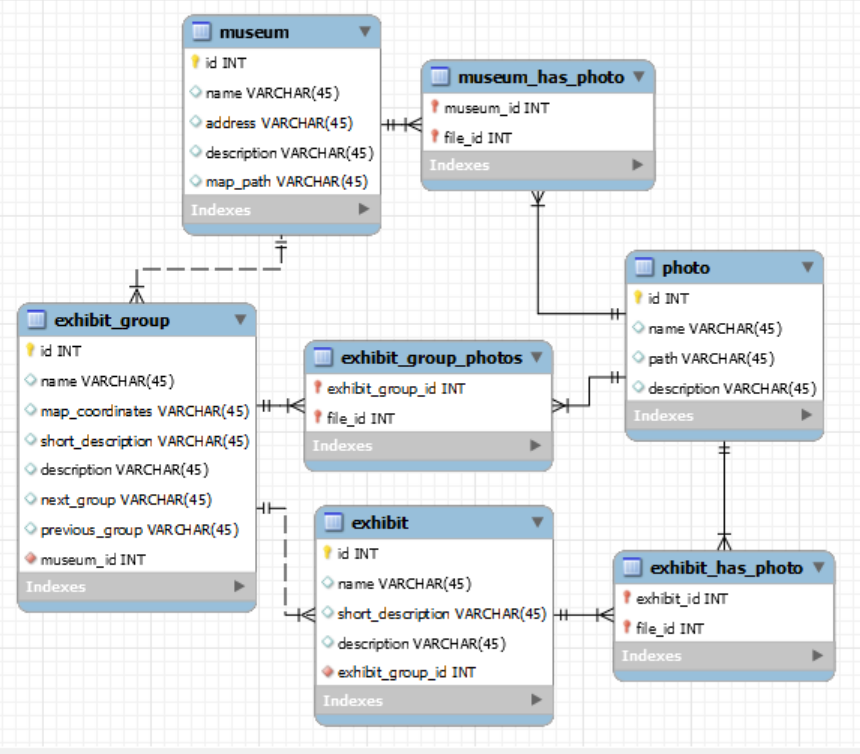

# ITMO Optics Museum plan

## Motivation

The site aims to provide the user with detailed and complete information about the exhibits and the internal scheme
of the ITMO optics museum. Our main motivation is to provide to customers plan of museum that now you can
find nowhere neither on museum's website and public internet.
Also the site provides details of the history of the exhibits and their scientific purpose.

## Installation
1. run ```cp .env.example .env``` and set up your env variables
2. run ```php artisan migrate``` to migrate database
3. run ```php artisan db:seed``` to seed the data
4. run ```php artisan storage:link```
5. run ```php artisan serve``` to start local server 
6. enjoy

## Application structure
You can find workbench database scheme inside `database/scheme`


